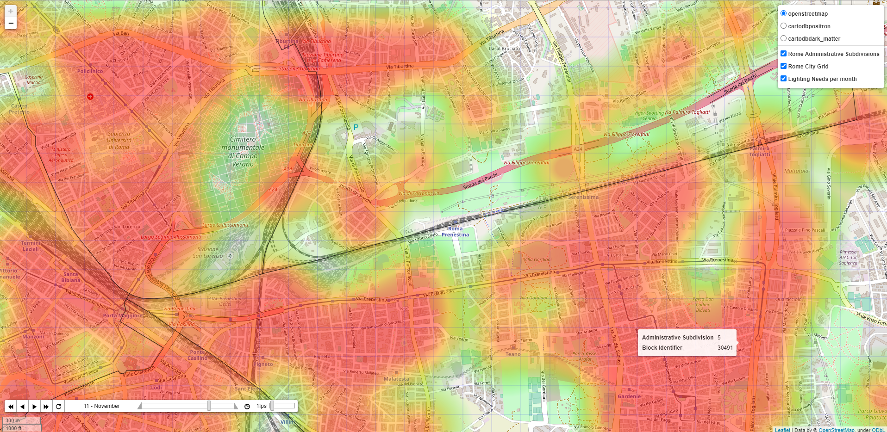
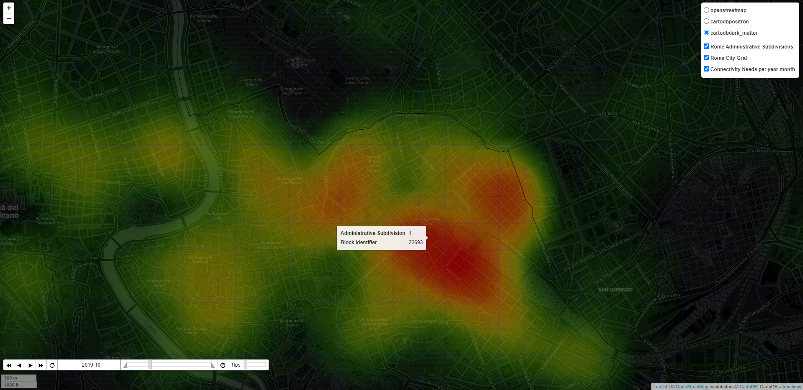

<h3 align="center">DINA - Data-driven Implicit Needs Analyzer</h3>

---

<p align="center"> A tool which leverages Public Administration Open Data to provide cities with actionable insights about what citizens implicitly need in terms of security, lighting and connectivity
    <br> 
</p>

##  Table of Contents

- [About](#about)
- [Getting Started](#getting_started)
- [Usage](#usage)
- [Built Using](#built_using)

##  About <a name = "about"></a>

This project is a proposal submitted in the scope of an Innocentive Challenge [New Smart City Solutions Enabled by Open Data](https://openinnovability.enel.com/projects/New-smart-city-solutions-enabled-by-open-data)
Our targeted users are: 
1.	Chief Operating Officer and/or operations of the city’s public lighting department
2.	Analysts working in the Urban Planning department
3.	Tourist Office officers (City Destination Marketing Organizations)

The solution prototyped in the scope of this project is called DINA (Data-driven Implicit Needs Analyzer) and is made of 2 main components:

1.	DINA Open Data ingestion module
It aims at becoming a transversal component, supported by an extensible framework, which gathers, cleans, enriches and normalizes Open Data (coming from Public Administrations or not) in order to provide Smart City analytics solutions with 3 indexes representing the needs of people living in or visiting the city: 
•	Security Needs
•	Lighting Needs
•	Connectivity Needs
These indexes will be delivered per geographical location (square of 20m x 20m) and per month.

Note: our vision is obviously to increase granularity (lower the size of the geographical areas, provide data per day or even per hour) when Public Administration Open Data will permit and this is why Enel X has a key role to play to influence City’s Open Data roadmaps.

2.	DINA “Needs Indexes” Visualization tool
The solution includes a data visualization module so that users could act according to the insights generated by the first module: maps/heatmap (with the possibility to browse per time period - in our case: month- and to filter by type of index). 
Note: In the scope of this challenge, the visualization solution will be delivered as a standalone User Interface, but the vision is to integrate it in City Analytics and Control Room directly, to complement existing visualization tools (e.g. adding a new layer to existing maps)


##  Getting Started <a name = "getting_started"></a>

These instructions will get you a copy of the project up and running on your local machine for development and testing purposes. See [deployment](#deployment) for notes on how to deploy the project on a live system.

### Prerequisites

Things you need to install the software and how to install them.

#### Here API Key to benefit from Here! Rest APIs
1. Get an Here! Freemium Account (location APIs) [here](https://developer.here.com/sign-up?create=Freemium-Basic&keepState=true&step=account)
2. Create an app and generate an API key
3. Store the API key in an environment variable called `here_api_key` (for Windows 10, follow this [procedure](https://www.onmsft.com/how-to/how-to-set-an-environment-variable-in-windows-10))


### Installing Python and pip


You need to install:
1. a recent version of Python (at least 3.7.6, see [for instance this package for Windows](https://www.python.org/downloads/release/python-385/))
2. the pip tool in order to install Python packages (see [installation guide](https://www.liquidweb.com/kb/install-pip-windows/))

Once pip is installed, run the following command to download and install the requested python packages (folium for maps display, pandas for csv files processing)  line and typing

`$ pip install -r requirements.txt`


##  Usage <a name="usage"></a>

## Run the DINA Open Data Ingestion module

The first (optional) step is to process the input data from Open Data portals. This is done with the process_input_data block:
`$ python process_input_data.py`

This will generate some data files in the output_data folder. 
Note: **this step is not required to start testing the solution** as some datasets requesting processing have already been generated and included in the repository. Indeed, some of them require heavy processing to be created. In particular, the hotel csv needs to call a geocoding API for each of the 90,000 hotels in Rome, which can take a long time. 

From the files in the output_data, the indices can be generated. These are weighted averages of a subset of data indicators, as defined in the main method of create_indexes.py . To generate the indices, run:
`$ python create_indexes.py`


## Generate and display the DINA Heat Maps (Lighting Needs Index, Security Needs Index, Connectivity Needs Index)

Open a command line and go to the folder where DINA has been downloaded and commands:
`$ python display_heatmap.py`

### Examples of generated maps

It will generate 2 sets of 3 html files containing the maps in the sub-folder ./map/ and try to open them with a web browser:
Indexes per month (whatever the year is, i.e. data is consolidated per month)
* [DINA_Rome_Italy_300mX300m_Lighting_Needs_per_month_Heatmap.html](./map/DINA_Rome_Italy_300mX300m_Lighting_Needs_per_month_Heatmap.html)
* [DINA_Rome_Italy_300mX300m_Security_Needs_per_month_Heatmap.html](./map/DINA_Rome_Italy_300mX300m_Security_Needs_per_month_Heatmap.html)
* [DINA_Rome_Italy_300mX300m_Connectivity_Needs_per_month_Heatmap.html](./map/DINA_Rome_Italy_300mX300m_Connectivity_Needs_per_month_Heatmap.html)

Indexes per year-month (better view for historical indexes per month, since 2019)
* [DINA_Rome_Italy_300mX300m_Lighting_Needs_per_year-month_Heatmap.html](./map/DINA_Rome_Italy_300mX300m_Lighting_Needs_per_year-month_Heatmap.html)
* [DINA_Rome_Italy_300mX300m_Security_Needs_per_year-month_Heatmap.html](./map/DINA_Rome_Italy_300mX300m_Security_Needs_per_year-month_Heatmap.html)
* [DINA_Rome_Italy_300mX300m_Connectivity_Needs_per_year-month_Heatmap.html](./map/DINA_Rome_Italy_300mX300m_Connectivity_Needs_per_year-month_Heatmap.html)

Corresponding indexes files (csv) are available here:
* [lighting_needs_index.csv](./map/lighting_needs_index.csv)
* [security_needs_index.csv](./map/security_needs_index.csv)
* [connectivity_needs_index.csv](./map/connectivity_needs_index.csv)

Example of Heatmap for the city of Roma and Lighting Needs estimation in November (centred on Roma Municipio V):


In the example above, we did not deduct any special lighting needs inside the "Cimitero monumentale di Campo Verano"... data is talking!


Example of Heatmap for the city of Roma and estimated historical Wi-fi connectivity Needs in October 2019 (centred on Roma Municipio I):


In the example above (using another type of display, closer to a 'Control Room'), the wi-fi connectivity need is probably influenced by a higher concentration of accommodations attracting tourists

Example of animated Heatmap for the city of Roma showing estimated lighting Needs estimation overtime from January to December:


##  Built Using <a name = "built_using"></a>

- [Folium](https://python-visualization.github.io/folium/) - Maps generation
- [Pandas](https://pandas.pydata.org/) - CSV Files analysis
- [Here Geolocation APIs](https://developer.here.com/) - Geocoding of Hotels/Accomodation data


## Datasets used in the scope of this proof of concept

Main source of data: [Roma Open Data portal](https://dati.comune.roma.it/catalog/en/dataset)

Dataset Name | Description | Provider | Resource | Period Covered | Comments
-------------|-------------|----------|----------|----------------|----------
[Hotels/Accommodation Data](./input_data/hotel_locations.csv) | List of accommodation facilities in Rome Capital in 2019-2020.  | [Roma Open Data Portal](https://dati.comune.roma.it) | [Roma Capitale accommodation facilities in 2020](https://dati.comune.roma.it/catalog/dataset/d865) | 01/2019 - 08/2020 | The format of dataset changes from one month to another in 2019 so we voluntary skipped some months to make the process easier
[Accidents Data](./input_data/csv_incidenti_merge_20192020.csv) | The dataset contains the list of road accidents that occurred in the territory of Roma Capitale in the year 2019. The dataset contains all the road accidents in which a patrol of any Group of the Roma Capitale Local Police intervened. Therefore, only incidents in which the parties involved have reached a conciliation are excluded. The dataset does not include the accidents that occurred on the Grande Raccordo Anulare of Roma Capitale. | [Roma Open Data Portal](https://dati.comune.roma.it) | [Road accidents in the territory of Roma Capitale - Year 2019-2020](https://dati.comune.roma.it/catalog/dataset/d852) | 01-2019 - 12/2019, 01/2020 - 02/2020 | we merged monthly data files into 1 consolidated file
[Public wifi Data](https://dati.comune.roma.it/catalog/dataset/wifi2020) | Anonymized web browsing sessions found in the Rome WiFi system | [Roma Open Data Portal](https://dati.comune.roma.it) | [Anonymized web browsing sessions found in the Rome WiFi system](https://dati.comune.roma.it/catalog/dataset/wifi2020) | 04/01/2020 to 30/09/2020 |  
Shapes of Administrative Subdivisions | Shapes of Roma Municipi in geojson format (municipi.geojson) | Roma Urbanistica | https://romaurbanistica.carto.com/tables/municipi/public | N/A | 
[Single Reporting System of Roma Capitale. Reporting data for the year 2020](https://dati.comune.roma.it/catalog/dataset/sus1) | The Dataset aims to represent a framework for managing the flow of reports from citizens through the SUS (Single Reporting System https://www.comune.roma.it/web/it/di-la-tua-segnala.page ), steps and actions that are taken from opening to closing the issue. The reports present are geo-localized by municipality and by subject - the data of the reports published are as they appear from the user reports, regardless of the veracity certified or not with respect to what is reported. | [Roma Open Data Portal](https://dati.comune.roma.it) | [Single Reporting System of Roma Capitale. Reporting data for the year 2020](https://dati.comune.roma.it/catalog/dataset/sus1) | 01/2020 to 07/2020 | We used a subset of claims types (aka 'Argomento - codice')


## How to change important parameters

### Grid size
The grid size governs the granularity of the indexes, and in turn of the heatmaps. The size of the blocks is set in two variables in `config.py`:
```
block_width = 300
block_height = 300
```
To change the grid size, change these values, and re-run the `process_input_data.process_input_data()` method to re-generate the indexes with the new grid.

### Weight of the data sources in the indexes
The final three indexes (lighting, connectivity and security) are weighted sums of indexes over the different data sources. The weighing is set in the `indexes_calculation_parameters` dictionary in the `config.py` module. You can modify the values of the dictionary (float from 0.0 to 1.0) in order to change the weights of the data sources in each index and thus influence the global index, based on your analysis of which data is more relevant to infer implicit requirements from citizens and visitors.

```
indexes_calculation_parameters = {
    'lighting': {
        'accidents': 0.4,
        'hotels': 0.2,
        'wifi': 0.2,
        'lighting_claims': 0.2
    },
    'connectivity': {
        'hotels': 0.5,
        'wifi': 0.5
    },
    'security': {
        'accidents': 0.5,
        'security_claims': 0.5
    },
}
```


## Python modules in this repository

### config.py
Contains general configuration, location of input files, and the weighting of the different data sources for the three final indexes

### create_indexes.py
The main method of this module generates the different indexes from the processed files in `output_data`. It uses the weights from `config.py`

### display_heatmap.py
The main method of this module takes the generated indexes and generates the final heatmaps

### get_accidents_geodata.py
The main method of this module processes the accidents data from the input_data folder, and counts the number of accidents that occurred with insufficient lighting per grid block and month. It is called from `process_input_data.py`

### get_claims_geodata.py
The main method of this module processes the claims data from the `input_data` folder. As the claims data is only available at the administrative division level, the claims relative to the target categories (security and lighting) are counted by month and by administrative subdivision (e.g. municipio in the case of Rome). All the blocks in an administrative division are then given the score corresponding to that division. It is called from `process_input_data.py`

### get_hotels_geodata.py
The main method of this module processes the hotel location data from the `input_data` folder. If the processed data is not geolocalized (i.e if the latitude and longitude columns are not present), the module calls the HERE api to geolocalize the hotel from its address, and outputs the input file with the added geolocalization columns as well (this helps saving extra calls). The main output is a count of rooms by grid block and month. It is called from `process_input_data.py`

### get_wifi_logs_geodata.py
The main method of this module processes the wifi usage data from the `input_data` folder. If the processed data is not geolocalized (i.e if the latitude and longitude columns are not present), the module calls the HERE api to geolocalize the wifi hotspot from its address, and outputs the input file with the added geolocalization columns as well. Within the processing, coordinates for the wifi spots is also cached, as there can be many usage logs for a single wifi hostpot. The main output is the overall download data usage by grid block and month. It is called from `process_input_data.py`

### process_input_data.py
The main method of this module processes the different data sources located in the `input_data` folder. It calls individual data processing modules for each of the datasets (accidents, hotels, wifi and claims)

### utils.py
This module contains various methods that are used by other modules. In particular, it contains the method to call the geolocalization API (HERE), and different utilities for generating the geographical grid.

