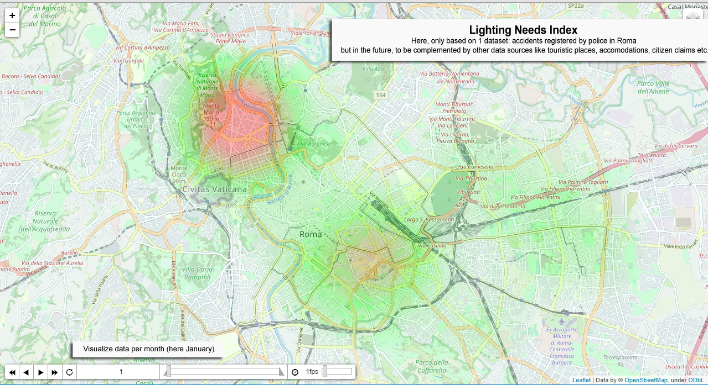

<h3 align="center">DINA - Data-driven Implicit Needs Alanyzer</h3>

---

 A tool which leverages Public Administration Open Data to provide cities with actionable insights about what citizens implicitly need in terms of seciruty, lighting and connectivity
      

##  Table of Contents

- [About](#about)
- [Getting Started](#getting_started)
- [Usage](#usage)
- [Built Using](#built_using)

##  About 

This project is a proposal sublitted in the scope of an Innoventive Challenge [New Smart City Solutions Enabled by Open Data](https://openinnovability.enel.com/projects/New-smart-city-solutions-enabled-by-open-data)
Our targeted users are: 
1.	Chief Operating Officer and/or operations of the city’s public lighting department
2.	Analysts working in the Urban Planning department
3.	Tourist Office officers (City DMOs)

The solution prototyped in the scope of this project is called DINA (Data-driven Implicit Needs Analyzer) and is made of 2 main components:

1.	DINA Open Data ingestion module
It aims at becoming a transversal component, supported by an extensible framework, which gathers, cleans, enriches and normalizes Open Data (coming from Public Administrations or not) in order to provide Smart City analytics solutions with 3 indexes representing the needs of people living in or visiting the city: 
•	Security Needs
•	Lighting Needs
•	Connectivity Needs
These indexes will be delivered per geographical location (square of 20m x 20m) and per month.

Note: our vision is obviously to increase granularity (lower the size of the geographical areas, provide data per day or even per hour) when Public Administration Open Data will permit and this is why Enel X has a key role to play to influence City’s Open Data roadmaps.

2.	DINA “Needs Indexes” Visualization tool
The solution includes a data visualization module so that users could act according to the insights generated by the first module: maps/heatmap (with the possibility to browse per time period - in our case: month- and to filter by type of index). 
Note: In the scope of this challenge, the visualization solution will be delivered as a standalone User Interface, but the vision is to integrate it in City Analytics and Control Room directly, to complement existing visualization tools (e.g. adding a new layer to existing maps)

##  Getting Started 

These instructions will get you a copy of the project up and running on your local machine for development and testing purposes. See [deployment](#deployment) for notes on how to deploy the project on a live system.

### Prerequisites

Things you need to install the software and how to install them.

#### Here API Key to benefit from Here! Rest APIs
1. Get an Here! Freemium Account (location APIs) [here](https://developer.here.com/sign-up?create=Freemium-Basic&keepState=true&step=account)
2. Create an app and generate an API key
3. Store the API key in an environment variable called `here_api_key` (for Windows 10, follow this [procedure](https://www.onmsft.com/how-to/how-to-set-an-environment-variable-in-windows-10))

### Installing Python and pip

You need to install:
1. a recent version of Python (see [for instance this package for Windows](https://www.python.org/downloads/release/python-385/))
2. the pip tool in order to install Python packages (see [installation guide](https://www.liquidweb.com/kb/install-pip-windows/))

Once pip is installed, run the following command to downloadand install the requested python packages (folium for maps display, pandas for csv files processing)  line and typing

`$ pip install -r requirements.txt`

##  Usage 

## Run the DINA Open Data Ingestion module

The first (optional) step is to process the input data from Open Data portals. This is done with the process_input_data block:
`$ python process_input_data.py`

This will generate some data files in the output_data folder. 
Note: **this step is not required to start testing the solution** as some datasets requesting processing have already been generated and included in the repository. Indeed, some of them require heavy processing to be created. In particular, the hotel csv needs to call a geocoding API for each of the 90,000 hotels in Rome, which can take a long time. 

From the files in the output_data, the indices can be generated. These are weighted averages of a subset of data indicators, as defined in the main method of create_indexes.py . To generate the indices, run:
`$ python create_indexes.py`

## Generate and display the DINA Heat Maps (Lighting Needs Index, Security Needs Index, Connectivity Needs Index)

Open a command line and go to the folder where DINA has been downloaded and commands:
`$ python display_maps.py`

It will generate 3 html files containing the maps in the sub-folder ./map/ and try to open them with a web browser:
* [DINA_Lighting_Needs_Index.html](./map/DINA_Lighting_Needs_Index.html)
* [DINA_Security_Needs_Index.html](./map/DINA_Security_Needs_Index.html)
* [DINA_Connectivity_Needs_Index.html](./map/DINA_Connectivity_Needs_Index.html)

##  Built Using 

- [Folium](https://python-visualization.github.io/folium/) - Maps generation
- [Pandas](https://pandas.pydata.org/) - CSV Files analysis
- [Here Geolocation APIs](https://developer.here.com/) - Geocoding of Hotels/Accomodation data

## Datasets used in the scope of this proof of concept

Dataset Name | Description | Provider | Resource | Period Covered | Comments
-------------|-------------|----------|----------|----------------|----------
[Hotels/Accomodation Data](./input_data/hotel_locations.csv) | List of accommodation facilities in Rome Capital in 2020.  | [Roma Open Data Portal](https://dati.comune.roma.it) | [Roma Capitale accommodation facilities in 2020](https://dati.comune.roma.it/catalog/dataset/d865) | 01/2020 | We assumed that number of accomodations did not change over time but an improvement will be to aggregate all months
[Accidents Data](./input_data/csv_incidenti_merge_20192020.csv) | The dataset contains the list of road accidents that occurred in the territory of Roma Capitale in the year 2019. The dataset contains all the road accidents in which a patrol of any Group of the Roma Capitale Local Police intervened. Therefore, only incidents in which the parties involved have reached a conciliation are excluded. The dataset does not include the accidents that occurred on the Grande Raccordo Anulare of Roma Capitale. | [Roma Open Data Portal](https://dati.comune.roma.it) | [Road accidents in the territory of Roma Capitale - Year 2019-2020](https://dati.comune.roma.it/catalog/dataset/d852) | 01-2019 - 12/2019, 01/2020 - 02/2020 | we merged monthly data files into 1 consolidated file
Municipi Shapes | Shapes of Roma Municipi in geojson format (municipi.geojson) | Roma Urbanistica | https://romaurbanistica.carto.com/tables/municipi/public | N/A | 

